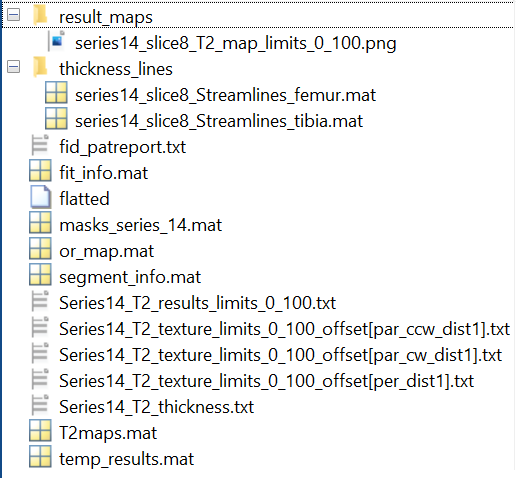
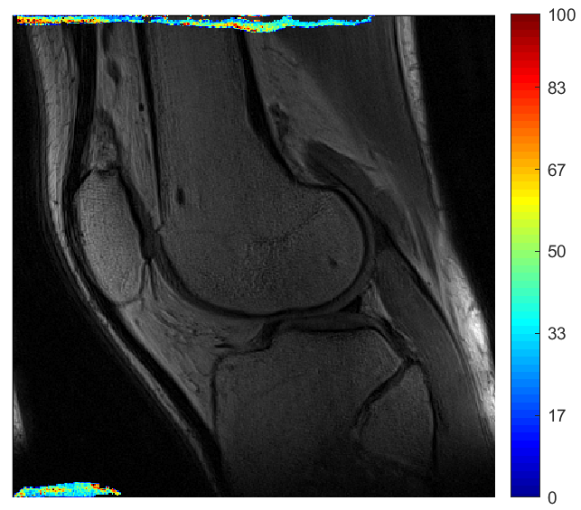

# WHAT ARE THE TEXTURES FUNCTIONS DOING ?

## First function : convert_segmentations_to_dicom_final.m

### Dependencies ?

`No dependencies` with a specific function but it `uses data` such as :

- user_preferences.mat
- segment_info
- fit_info
- T2 maps

The function uses the previous segmented image in mokkula.

### What is it doing ?

By running this function, you create a `IMA file` openable with 'dicomread' on Matlab that specifies in his name the serie and the segmentation you are working with. This file is created in a copy of the folder name where your data is with 'Mokkulamaps' added.

> `Example` : If your data is saved in a folder named *'Anonymized - 04071989'*, then the file created will be created in a folder named *'.Anonymized - 04071989_Mokkulamaps'*. By following the same path, you will find a file in this folder named *'series14_slice8_Segmentation.IMA'* depending on the series and the slice you made the segmentation.

The file created contains a 384 * 384 * 3 matrix with values between 0 and 255 which corresponds to the intensity of each pixel. This .IMA format is like dicom images. Once you open it you can see this :

| Segmentation | T2 map |
| :----------: | :----: |
| |  |

It looks like the colors are inverted and the 'Segmentation' image shows the intensity of each pixel.

### What wasn't working well ?

Line 51, it was written : 

```matlab
    isfolder(patients(patient).name && patients(patient).name(1) ~= '.');   
```

But isfolder on Matlab takes a text in argument so it wasn't working. I replaced this by :  

```matlab
    if (patients(patient).name & patients(patient).name(1) ~= '.');  
```

## Second function : flat_converter.m

### Dependencies ?

`Dependencies` with specific functions :

- main_flat.m
- format_results.m
- texture2_fast
- ...*Let's see the function dependencies diagram*


And it `uses data` such as :

- segment_info
- results_flat
- fit_info
- T2maps 

### What is it doing ?

This function is creating a `new folder` with all the data flatted. As the function is in the 'flatter' folder, the name of the new folder is 'flatter_flat'. Here is a screen of all the files created in 'flatter_flat' :

<center>

</center>

In the 'result_maps' folder, the image we can see is this one :

<center>

</center>

But this figure is **wrong**, we should see something like the images of 'convert_segmentations_to_dicom_final.m'. We can see some colored points at the bottom and the top of the image, they are not at the right place.

An another figure is created too : it is the streamlines of the femur and the tibia. The values are saved in the 'thickness_lines.m'. Here it is :

<center>

</center>

### What was wrong with it ?
 
> *Before running this function, one needs to run 'main_flat.m' because it is here that 'results_flat.m' is created if already not created.*  
> *Before running, remove the 'data' folder that is in 'analyysimokkula' from the matlab path because it is not the one we are using.*

One file looks like missing when we run this function : 'results_flat.m'.  
So I tried to figure out when should this file be created. It appears that this file is created in the function 'main_flat.m'.

I added at the beginning of 'results_flat.m', line 17 : 
```matlab
    load T2maps
```

I also manually changed the values of seg_general because 

```matlab
seg_general(7).backimgs(i).folder(j).name
```  
and  
```matlab
seg_general(7).backimgs(i).filename(j).name
```  
were refering to another data than the one I was using.

In 'main_flat.m', many errors :

1. check.fit didn't exist, I added a line at line 59 :

    ```matlab
        check.fit = exist('fit_info.mat', 'file');
    ```

2. Problems with the 'for loop' because it is not entering it. The 'what' command was not made in the good folder so I added a 'cd' at line 60 :

    ```matlab
        cd ('C:\Users\elebail22\OneDrive - Oulun yliopisto\Documents\Stage_2A\Eve_stuff\mokkula_test_data\Anonymized - 04071989\Fyysikot Vic\mokkulafiles\20-Jun-2022-09.51.15');
        matfilelist = what;
    ```

    And in the same code, the file 'results_flat' was not created in the right folder, so I added this at line 88 :

    ```matlab
        cd ('C:\Users\elebail22\OneDrive - Oulun yliopisto\Documents\Stage_2A\Eve_stuff\mokkula\analyysimokkula\flatter')
        savefile = 'results_flat';
    ```

3. Line 85, by calling the function 'execute_flat.m' which is defined in the same file, it makes an error related to the 'structure_loop.m' function at line 172. In this function, there are problems related to the use of structure in Matlab. At line 26, it was initially written this :

    ```matlab
        slices = zeros(length(seg_general(series).lines), 1);
        for ii = 1 : length(seg_general(series).lines)
            if isreal(seg_general(series).lines(ii).lines) == 0
                slices(ii) = 1;
            else
                slices(ii) = 0;
            end
        end 
        slice = find(slices);
    ```
    But it is impossible to take the length of this type of object. 'Series' is a list and 'seg_general(series).lines' is a array of struct array. Moreover, we cannot write 'seg_general(series).lines(ii).lines' because there are 2 results.  
    So, I decided to temporarily write this instead :

    ```matlab
        slices = zeros(18, 1);
        size_series = size(series);
        for ii = 1 : size_series
            for jj = 1 : 18
                if isreal (seg_general(series(ii)).lines(jj).lines) == 0
                    slices(jj) = 1;
                else
                    slices(jj) = 0;
                end
            end
        end 
        slice = find(slices);
    ``` 

    And it seems that it resolves the problem for now.

4. So now, back to the 'main_flat.m' function, another error comes up that refers to the 'coordinates.m' function :

    At line 6, it was written this, but it is a similar problem than before, we cannot write this because 'index.serie' is an array :

    ```matlab
        x = seg_general(index.serie).lines(index.slice).lines(t).X;
        y = seg_general(index.serie).lines(index.slice).lines(t).Y;
    ``` 

    So I wrote this instead :

    ```matlab
        size_serie = length(index.serie);
        for i = 1 : size_serie
            x = seg_general(index.serie(size_serie)).lines(index.slice).lines(t).X;
            y = seg_general(index.serie(size_serie)).lines(index.slice).lines(t).Y;
        end
    ``` 

    Looks like 'coordinate.m' is now working well.
 
5. Back in 'main_flat.m', another error to fix refering to 'runflat.m'.

    One error is related to the same problem than before (access to a struct of struct).  
    At line 86, I wrote this :

    ```matlab
        serie_size = length(index.serie);
        for i = 1 : serie_size
            Timage = Tmap(index.serie(serie_size)).T2(:, :, index.slice);
        end
    ```

    Instead of this :

    ```matlab
        Timage = Tmap(index.serie).T2(:,:,index.slice);
    ```

    It now seems that 'run_flat.m' is working.

6. One error occurs at lines 187 and 197 in 'main_flat.m', it was written :

    ```matlab
        Tmap_flat.femur{index.serie}(index.slice) = runflat(Tmap, seg_general, template, index, check);
    ```

    But, at left we have a problem of size, I wrote :

    ```matlab
        Tmap_flat.femur = runflat(Tmap, seg_general, template, index, check);
    ```

    It seems okay now.

7. The variable 'param' is not found in 'main_flat.m' so I am trying to figure out to what it refers. I see no variable like this in the different codes, I decided to do without though :

    At line 96, I wrote :

    ```matlab
        save(savefile, 'T2map_flat', 'dir_name')
    ```  
    instead of :

    ```matlab
        save(savefile, 'T2map_flat', 'param', 'dir_name')
    ```

**The file 'results_flat.mat' is now created !!**   
We can now go back to 'flat_converter.m'.

8. A major problem occurs now :

    ```matlab
        datasheet.femur{series}(rr).T_flat
    ```
    For example, the syntax 'datasheet.femur{series}(rr)' is not right because 'datasheet.femur' is a struct with different fields.  
    Then, I decided to replace all the lines using this by :

    ```matlab
        datasheet.femur.T_flat
    ```

    And I did the same with 
    ```matlab
        datasheet.tibia.T_flat
    ```

9. At line 141, we can see this :

    ```matlab
        temp_mask(1 : vert1, 1 : horz1) = zeros(1 : vert1, 1 : horz1);
    ```

    which is a wrong use of 'zeros', so I wrote this instead :

    ```matlab
        temp_mask(1 : vert1, 1 : horz1) = zeros(vert1, horz1);
    ```   

10. Now, I have an error related to sizes. In fact, at line 203 :

    ```matlab
        temp_map(series).T2(:, :, size(mask_avg, 2)) = temp_mask;
    ```  

    But, 'temp_mask' is 384 by 384 and 'temp_map' is 384 by 281.  
    I don't know from where this error comes yet but I'll figure it out. Maybe it is due to all my changes but this is not sure.

    For the moment, I decided to fill the smaller matrix with zeros. Line 204, it is now written :

    ```matlab
        temp_map(series).T2=[temp_map(series).T2 zeros(384, 103, 8)];
        temp_map(series).T2(:, :, size(mask_avg, 2)) = temp_mask;
    ```

11. And now, in 'format_results.m', I don't know to what fid_patreport refers to. So I have an error because it is not the good format when calling the function. 
    I finally understood that 'fid_patreport' was supposed to be a text file so I decided to create it, at line 204 :

    ```matlab
    fid_patreport = fopen('fid_patreport.txt','w');
    ```

12. I changed the call of the function format_results because it was not logical for me in flat_converter at line 264. NEED TO SEE IF IT WORKS........I felt like it was not the good argument place in the call.

     Originally, the function is defined like this :

    ```matlab
        format_results(series,flipped,firstresults,sequence_save_info,patientname,fid_patreport,series_loc,xlimits,ylimits,backimgs,varargin)
    ```

    So I wrote this :
       
    ```matlab
        format_results(series, seg_general(series).flipped, seg_general(series).minvalue, ...
        seg_general(series).maxvalue, fit_info(series).patientname, zeros(size(mask_stack)), ...
            thisfolder, size(temp_mask, 1), size(temp_mask, 2), seg_general(series).backimgs)
    ```
     Instead of this :

    ```matlab
        format_results(series, seg_general(series).flipped, seg_general(series).minvalue, seg_general(series).maxvalue, ...
        0, 0, fit_info(series).patientname, 0, thisfolder, size(temp_mask, 1), size(temp_mask, 2),zeros(size(mask_stack)))
    ```

14. In 'flat_converter.m', one error was related to 'roilist' : initially, this variable comes from 'masks_series_14.m' which is part of the data. In this file, 'roilist' is a struct with logical values or in 'flat_converter.m', the 'roilist' variable created was a struct with double. So I changed double to logical values by adding the 'logical' function of Matlab each time the code was constructing 'roilist' :

```matlab
    roilist(rr).bF = logical(temp_mask);
```

15. Then, it appeared that in 'format_results.m', one error is related to 'laplacian_thickness.m' : the limits of the array size were reached (0 and 365). Thus, I thought of adding lines or colunms of zeros (and delete the extra one) depending on whether the calculations were made for the femur or the tibia. At line 136, I added this :

```matlab
    switch which_cartilage
    case 1 % femur
        maski = [ logical(zeros(1, 384)) ; maski(1:383, :)];
    case 2 % tibia
        maski = [ logical(zeros(384, 1)) maski(:, 1:383)];
        maski = [maski(2:384, :) ; logical(zeros(1, 384))];
    end
```

16. In 'texture2_fast.m', the variable 'text_bF' is not known. The problem is that the *'for loop'* is not run. This is due to 'data_slice' that is null everywhere. It means that 'T2map(14).T2' is equal to zero.

To resolve this, I traced the source of the problem : this led me to the 'inputs.m' function in 'runflat'.m, the ROI calculation gives something null so 'Timage' was null and so 'temp_map' was null too. I comment this line 92 :

```matlab
    [size_im] = size(Timage); % Gets the size of the image
    % image     = zeros(size_im);
    [ROI]     = roipoly(Timage, xr, yr); % it was written roipoly(image,xr,yr)
    % Timage    = ROI.*Timage;       % Let's restrict areas outside the ROI
```

I can now run the 'flat_converter.m' function without any errors but I think that there is something to change for the ROI because I sort of avoided the problem but then the results are not exact I guess *(see the images at the beginning)*.

## Third function : main_flat.m

### Dependencies ?

`Dependencies` with specific functions :

- ...*Let's see the function dependencies diagram*


And it `uses data` such as :

- T2maps 
- segment_info

### What is it doing ?

This function is `essential for the image flattening`. It runs the flatting process, gets the coordinates of ROI, defines the vector needed for tformation, calculates the thickness of cartilage, the image tranformation and created the segmented ROIs.

It `creates the file 'results_flat'` which is essential for 'flat_converter.m'.