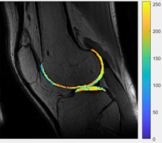

# WHAT ARE THE TEXTURES FUNCTIONS DOING ?

## First function : convert_segmentations_to_dicom_final.m

### Dependencies ?

`No dependencies` with a specific function but it `uses data` such as :

- user_preferences.mat
- segment_info
- fit_info
- T2 maps

The function uses the previous segmented image in mokkula.

### What is it doing ?

By running this function, you create a `IMA file` openable with 'dicomread' on Matlab that specifies in his name the serie and the segmentation you are working with. This file is created in a copy of the folder name where your data is with 'Mokkulamaps' added.

> `Example` : If your data is saved in a folder named *'Anonymized - 04071989'*, then the file created will be created in a folder named *'.Anonymized - 04071989_Mokkulamaps'*. By following the same path, you will find a file in this folder named *'series14_slice8_Segmentation.IMA'* depending on the series and the slice you made the segmentation.

The file created contains a 384 * 384 * 3 matrix with values between 0 and 255 which corresponds to the intensity of each pixel. This .IMA format is like dicom images. Once you open it you can see this :

| Segmentation | T2 map |
| ----------- | ------ |
|  |  |

It looks like the colors are inverted and the 'Segmentation' image shows the intensity of each pixel.

## Second function : flat_converter.m

### Dependencies ?

`No dependencies` with a specific function but it `uses data` such as :

- segment_info
- results_flat
- fit_info

### What is it doing ?

